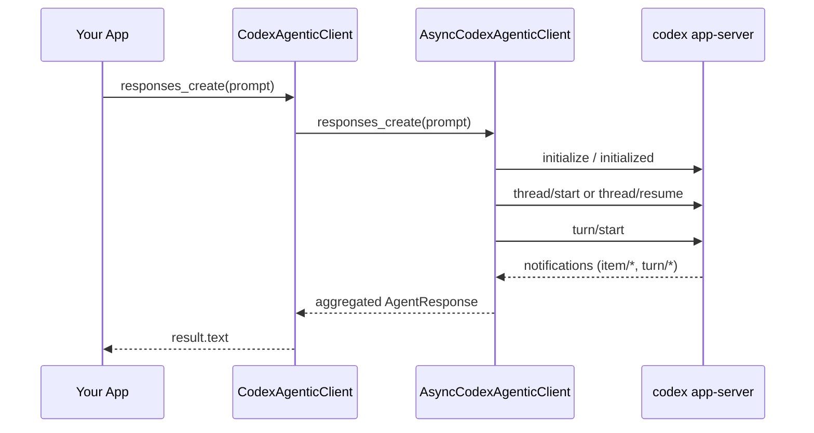

# Core Mechanism: How `codex-python-sdk` Works

[English](./core_mechanism.md) | [简体中文](./zh/core_mechanism.md)

This document is the architecture guide for the SDK core.

If you only remember four things, remember these:

1. Transport is `stdio + JSON-RPC`, not HTTP.
2. `_request()` is the foundation for almost all SDK APIs.
3. `responses_events()` is the real execution pipeline.
4. `responses_create()` is a convenience aggregator over `responses_events()`.

## Scope and Positioning

- This document focuses on SDK core control flow.
- `docs/app_server.md` focuses on protocol concepts and message taxonomy.
- `docs/tutorial.md` focuses on practical usage.

Read this page when you want to understand how one prompt moves through process startup, JSON-RPC, event streaming, and final response assembly.

## Layered Architecture

1. `codex app-server`: local runtime process speaking JSON-RPC over stdio.
2. `AsyncCodexAgenticClient`: transport + protocol + event orchestration core.
3. `CodexAgenticClient`: sync facade that calls async core from a background event loop thread.

There is one real implementation (async core), plus one sync adapter layer.

## End-to-End Call Path

One `responses_create(prompt=...)` call follows this path:

1. `create_client()` creates `CodexAgenticClient`.
2. Sync facade forwards method call to async core.
3. Async core ensures process connection (`connect()`) and JSON-RPC handshake.
4. `responses_events()` performs `thread/start|resume`, then `turn/start`.
5. Reader loop consumes notifications until `turn/completed`.
6. `responses_create()` aggregates event text into final `AgentResponse`.

## Sequence Diagram



## Minimal Core Skeleton (Simplified but Coherent)

This skeleton intentionally omits many production details, but keeps the core control flow accurate.

```python
import asyncio
import json
from dataclasses import dataclass
from typing import Any, AsyncIterator


@dataclass(slots=True)
class ResponseEvent:
    type: str
    text_delta: str | None = None
    message_text: str | None = None
    session_id: str | None = None
    turn_id: str | None = None
    raw: dict[str, Any] | None = None


class AsyncCore:
    def __init__(self) -> None:
        self.proc: asyncio.subprocess.Process | None = None
        self.pending: dict[int, asyncio.Future[dict[str, Any]]] = {}
        self.next_id = 1
        self.connected = False
        self.notification_queue: asyncio.Queue[dict[str, Any]] = asyncio.Queue()
        self.write_lock = asyncio.Lock()

    async def connect(self) -> None:
        if self.connected:
            return
        self.proc = await asyncio.create_subprocess_exec(
            "codex",
            "app-server",
            stdin=asyncio.subprocess.PIPE,
            stdout=asyncio.subprocess.PIPE,
            stderr=asyncio.subprocess.PIPE,
        )
        asyncio.create_task(self._reader_loop())

        # Handshake: avoid recursion by bypassing auto-connect inside _request.
        await self._request(
            "initialize",
            {"clientInfo": {"name": "core-demo", "version": "0.1"}},
            ensure_connected=False,
        )
        await self._send_json({"jsonrpc": "2.0", "method": "initialized"})
        self.connected = True

    async def _reader_loop(self) -> None:
        assert self.proc is not None and self.proc.stdout is not None
        while line := await self.proc.stdout.readline():
            text = line.decode("utf-8", errors="replace").strip()
            if not text:
                continue
            try:
                msg = json.loads(text)
            except json.JSONDecodeError:
                continue
            if not isinstance(msg, dict):
                continue

            # 1) RPC response: resolve pending future by id.
            if "id" in msg and "method" not in msg:
                msg_id = msg.get("id")
                if isinstance(msg_id, int) and msg_id in self.pending:
                    fut = self.pending.pop(msg_id)
                    if not fut.done():
                        fut.set_result(msg)
                continue

            # 2) Server -> client request: approvals/tool callbacks.
            if "id" in msg and "method" in msg:
                asyncio.create_task(self._handle_server_request(msg))
                continue

            # 3) Notification stream.
            if "method" in msg:
                await self.notification_queue.put(msg)

    async def _send_json(self, payload: dict[str, Any]) -> None:
        if self.proc is None or self.proc.stdin is None:
            raise RuntimeError("app-server is not running")
        data = (json.dumps(payload, separators=(",", ":")) + "\n").encode("utf-8")
        async with self.write_lock:
            self.proc.stdin.write(data)
            await self.proc.stdin.drain()

    async def _request(
        self,
        method: str,
        params: dict[str, Any] | None = None,
        *,
        ensure_connected: bool = True,
    ) -> dict[str, Any]:
        if ensure_connected and not self.connected:
            await self.connect()

        req_id = self.next_id
        self.next_id += 1
        fut: asyncio.Future[dict[str, Any]] = asyncio.get_running_loop().create_future()
        self.pending[req_id] = fut

        payload: dict[str, Any] = {"jsonrpc": "2.0", "id": req_id, "method": method}
        if params is not None:
            payload["params"] = params
        await self._send_json(payload)

        raw = await fut
        if "error" in raw:
            raise RuntimeError(raw["error"])
        result = raw.get("result")
        return result if isinstance(result, dict) else {"value": result}

    async def _ensure_thread(self, session_id: str | None) -> str:
        if session_id is None:
            started = await self._request("thread/start", {})
            thread = started.get("thread")
            if isinstance(thread, dict) and isinstance(thread.get("id"), str):
                return thread["id"]
            raise RuntimeError("thread/start returned no thread id")

        # Simplified: resume existing thread directly.
        await self._request("thread/resume", {"threadId": session_id})
        return session_id

    async def _handle_server_request(self, msg: dict[str, Any]) -> None:
        # Simplified default behavior.
        req_id = msg.get("id")
        method = msg.get("method")
        if req_id is None:
            return
        if method in ("item/tool/requestUserInput", "tool/requestUserInput"):
            result = {"answers": {}}
        elif method == "item/tool/call":
            result = {
                "success": False,
                "contentItems": [{"type": "inputText", "text": "No tool handler configured."}],
            }
        else:
            result = {"decision": "accept"}
        await self._send_json({"jsonrpc": "2.0", "id": req_id, "result": result})

    @staticmethod
    def _notification_to_event(note: dict[str, Any]) -> ResponseEvent:
        method = str(note.get("method", "unknown"))
        params = note.get("params") if isinstance(note.get("params"), dict) else {}
        delta = params.get("delta") if isinstance(params.get("delta"), str) else None
        text = delta
        session_id = params.get("threadId") if isinstance(params.get("threadId"), str) else None
        turn_id = params.get("turnId") if isinstance(params.get("turnId"), str) else None
        return ResponseEvent(
            type=method,
            text_delta=delta,
            message_text=text,
            session_id=session_id,
            turn_id=turn_id,
            raw=note,
        )

    async def responses_events(
        self,
        *,
        prompt: str,
        session_id: str | None = None,
    ) -> AsyncIterator[ResponseEvent]:
        thread_id = await self._ensure_thread(session_id)
        turn = await self._request(
            "turn/start",
            {"threadId": thread_id, "input": [{"type": "text", "text": prompt, "text_elements": []}]},
        )
        turn_obj = turn.get("turn")
        turn_id = turn_obj.get("id") if isinstance(turn_obj, dict) else None

        while True:
            note = await self.notification_queue.get()
            event = self._notification_to_event(note)
            if event.session_id is None:
                event.session_id = thread_id
            yield event
            if event.type == "turn/completed" and (turn_id is None or event.turn_id in (None, turn_id)):
                break

    async def responses_create(
        self,
        *,
        prompt: str,
        session_id: str | None = None,
    ) -> str:
        chunks: list[str] = []
        async for event in self.responses_events(prompt=prompt, session_id=session_id):
            if event.type == "item/agentMessage/delta" and event.text_delta:
                chunks.append(event.text_delta)
        return "".join(chunks).strip()
```

## Why `_request()` Is the Foundation

`_request()` centralizes four critical responsibilities:

- request ID allocation
- request/response correlation via pending futures
- JSON-RPC error propagation
- connection bootstrap logic

That design keeps most public APIs thin and predictable wrappers over `_request()`.

## Why `responses_events()` Is the Real Core

`responses_events()` is where runtime behavior unfolds:

1. resolve thread scope (`thread/start` or `thread/resume`)
2. start turn (`turn/start`)
3. consume streaming notifications
4. stop on `turn/completed` or surface failures

If you are building UI, logs, telemetry, or progress rendering, this is the canonical integration point.

## Why `responses_create()` Is an Aggregator

`responses_create()` is intentionally a convenience layer:

- consume `responses_events()`
- aggregate assistant deltas/completion
- return final response object

Use `responses_create()` for "final answer only" workflows.
Use `responses_events()` when you care about intermediate runtime behavior.

## Sync Wrapper Responsibilities

`CodexAgenticClient` mainly does:

1. own a private event loop in a background thread
2. submit async coroutines via `run_coroutine_threadsafe`
3. expose blocking sync methods

This is why sync and async APIs stay behaviorally aligned.

## What Is Intentionally Omitted in the Skeleton

The production SDK adds important details not shown in this simplified code:

- notification buffering and matching by `thread_id` / `turn_id`
- richer event normalization (`phase`, `diff`, `token_usage`, `plan`)
- robust error mapping (`NotAuthenticatedError`, `SessionNotFoundError`, connection failures)
- policy/hook integration for approvals and tool interactions
- lifecycle cleanup and transport shutdown robustness

## Source Reading Map

- `codex_python_sdk/async_client.py`
- `codex_python_sdk/sync_client.py`
- `codex_python_sdk/types.py`
- `codex_python_sdk/factory.py`
