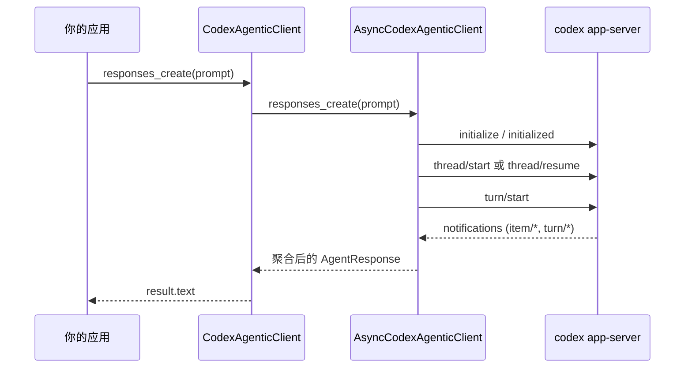

# 核心机制：`codex-python-sdk` 是如何工作的

[English](../core_mechanism.md) | [简体中文](./core_mechanism.md)

本文是 SDK 核心机制说明，目标是帮助你建立一套最小但完整的心智模型。

如果只记住 4 点，请记这 4 点：

1. 传输层是 `stdio + JSON-RPC`，不是 HTTP。
2. `_request()` 是几乎所有 API 的底座。
3. `responses_events()` 是真实执行主流程。
4. `responses_create()` 是对 `responses_events()` 的聚合封装。

## 文档定位

- 本文聚焦 SDK 核心调用链。
- `docs/zh/app_server.md` 聚焦协议概念和消息类型。
- `docs/zh/tutorial.md` 聚焦上手与实战用法。

当你想理解“一次 prompt 从调用到返回究竟经过了什么”，优先看本文。

## 分层架构

1. `codex app-server`：本地运行时进程，基于 stdio 说 JSON-RPC。
2. `AsyncCodexAgenticClient`：传输、协议、事件编排的核心实现。
3. `CodexAgenticClient`：同步外观层，通过后台 event loop 线程调用异步核心。

本质上是“一套异步核心实现 + 一层同步适配器”，不是两套并行实现。

## 端到端调用路径

一次 `responses_create(prompt=...)` 调用大致经历：

1. `create_client()` 创建 `CodexAgenticClient`。
2. 同步外观层把调用转发到异步核心。
3. 异步核心 `connect()` 拉起 `codex app-server` 并完成握手。
4. `responses_events()` 先做 `thread/start|resume`，再做 `turn/start`。
5. reader loop 持续消费通知，直到 `turn/completed`。
6. `responses_create()` 聚合事件文本并返回最终 `AgentResponse`。

## 时序图



## 核心代码骨架（精简但自洽）

下面代码有意省略了不少工程化细节，但核心控制流是完整的。

```python
import asyncio
import json
from dataclasses import dataclass
from typing import Any, AsyncIterator


@dataclass(slots=True)
class ResponseEvent:
    type: str
    text_delta: str | None = None
    message_text: str | None = None
    session_id: str | None = None
    turn_id: str | None = None
    raw: dict[str, Any] | None = None


class AsyncCore:
    def __init__(self) -> None:
        self.proc: asyncio.subprocess.Process | None = None
        self.pending: dict[int, asyncio.Future[dict[str, Any]]] = {}
        self.next_id = 1
        self.connected = False
        self.notification_queue: asyncio.Queue[dict[str, Any]] = asyncio.Queue()
        self.write_lock = asyncio.Lock()

    async def connect(self) -> None:
        if self.connected:
            return
        self.proc = await asyncio.create_subprocess_exec(
            "codex",
            "app-server",
            stdin=asyncio.subprocess.PIPE,
            stdout=asyncio.subprocess.PIPE,
            stderr=asyncio.subprocess.PIPE,
        )
        asyncio.create_task(self._reader_loop())

        # 握手：通过 ensure_connected=False 避免 connect/_request 递归。
        await self._request(
            "initialize",
            {"clientInfo": {"name": "core-demo", "version": "0.1"}},
            ensure_connected=False,
        )
        await self._send_json({"jsonrpc": "2.0", "method": "initialized"})
        self.connected = True

    async def _reader_loop(self) -> None:
        assert self.proc is not None and self.proc.stdout is not None
        while line := await self.proc.stdout.readline():
            text = line.decode("utf-8", errors="replace").strip()
            if not text:
                continue
            try:
                msg = json.loads(text)
            except json.JSONDecodeError:
                continue
            if not isinstance(msg, dict):
                continue

            # 1) RPC 响应：按 id 回填 pending future。
            if "id" in msg and "method" not in msg:
                msg_id = msg.get("id")
                if isinstance(msg_id, int) and msg_id in self.pending:
                    fut = self.pending.pop(msg_id)
                    if not fut.done():
                        fut.set_result(msg)
                continue

            # 2) server -> client 请求：审批/工具回调。
            if "id" in msg and "method" in msg:
                asyncio.create_task(self._handle_server_request(msg))
                continue

            # 3) 普通通知流。
            if "method" in msg:
                await self.notification_queue.put(msg)

    async def _send_json(self, payload: dict[str, Any]) -> None:
        if self.proc is None or self.proc.stdin is None:
            raise RuntimeError("app-server is not running")
        data = (json.dumps(payload, separators=(",", ":")) + "\n").encode("utf-8")
        async with self.write_lock:
            self.proc.stdin.write(data)
            await self.proc.stdin.drain()

    async def _request(
        self,
        method: str,
        params: dict[str, Any] | None = None,
        *,
        ensure_connected: bool = True,
    ) -> dict[str, Any]:
        if ensure_connected and not self.connected:
            await self.connect()

        req_id = self.next_id
        self.next_id += 1
        fut: asyncio.Future[dict[str, Any]] = asyncio.get_running_loop().create_future()
        self.pending[req_id] = fut

        payload: dict[str, Any] = {"jsonrpc": "2.0", "id": req_id, "method": method}
        if params is not None:
            payload["params"] = params
        await self._send_json(payload)

        raw = await fut
        if "error" in raw:
            raise RuntimeError(raw["error"])
        result = raw.get("result")
        return result if isinstance(result, dict) else {"value": result}

    async def _ensure_thread(self, session_id: str | None) -> str:
        if session_id is None:
            started = await self._request("thread/start", {})
            thread = started.get("thread")
            if isinstance(thread, dict) and isinstance(thread.get("id"), str):
                return thread["id"]
            raise RuntimeError("thread/start returned no thread id")

        # 简化版：直接 resume 既有 thread。
        await self._request("thread/resume", {"threadId": session_id})
        return session_id

    async def _handle_server_request(self, msg: dict[str, Any]) -> None:
        # 简化默认行为。
        req_id = msg.get("id")
        method = msg.get("method")
        if req_id is None:
            return
        if method in ("item/tool/requestUserInput", "tool/requestUserInput"):
            result = {"answers": {}}
        elif method == "item/tool/call":
            result = {
                "success": False,
                "contentItems": [{"type": "inputText", "text": "No tool handler configured."}],
            }
        else:
            result = {"decision": "accept"}
        await self._send_json({"jsonrpc": "2.0", "id": req_id, "result": result})

    @staticmethod
    def _notification_to_event(note: dict[str, Any]) -> ResponseEvent:
        method = str(note.get("method", "unknown"))
        params = note.get("params") if isinstance(note.get("params"), dict) else {}
        delta = params.get("delta") if isinstance(params.get("delta"), str) else None
        text = delta
        session_id = params.get("threadId") if isinstance(params.get("threadId"), str) else None
        turn_id = params.get("turnId") if isinstance(params.get("turnId"), str) else None
        return ResponseEvent(
            type=method,
            text_delta=delta,
            message_text=text,
            session_id=session_id,
            turn_id=turn_id,
            raw=note,
        )

    async def responses_events(
        self,
        *,
        prompt: str,
        session_id: str | None = None,
    ) -> AsyncIterator[ResponseEvent]:
        thread_id = await self._ensure_thread(session_id)
        turn = await self._request(
            "turn/start",
            {"threadId": thread_id, "input": [{"type": "text", "text": prompt, "text_elements": []}]},
        )
        turn_obj = turn.get("turn")
        turn_id = turn_obj.get("id") if isinstance(turn_obj, dict) else None

        while True:
            note = await self.notification_queue.get()
            event = self._notification_to_event(note)
            if event.session_id is None:
                event.session_id = thread_id
            yield event
            if event.type == "turn/completed" and (turn_id is None or event.turn_id in (None, turn_id)):
                break

    async def responses_create(
        self,
        *,
        prompt: str,
        session_id: str | None = None,
    ) -> str:
        chunks: list[str] = []
        async for event in self.responses_events(prompt=prompt, session_id=session_id):
            if event.type == "item/agentMessage/delta" and event.text_delta:
                chunks.append(event.text_delta)
        return "".join(chunks).strip()
```

## 为什么 `_request()` 是底座

`_request()` 集中处理了 4 件关键事情：

- 请求 id 分配
- 通过 pending future 做请求与响应关联
- JSON-RPC error 传递
- 连接初始化时机控制

因此大量公开 API 本质上都是 `_request()` 的薄封装。

## 为什么 `responses_events()` 才是执行核心

`responses_events()` 才是真正让运行时“动起来”的地方：

1. 决定 thread 范围（`thread/start` 或 `thread/resume`）
2. 启动 turn（`turn/start`）
3. 消费通知流并产出事件
4. 在 `turn/completed` 收束，或在错误事件上抛异常

如果你在做 UI、日志、可观测性，`responses_events()` 是主集成点。

## 为什么 `responses_create()` 看起来很“轻”

`responses_create()` 是便捷层：

- 消费 `responses_events()`
- 聚合 assistant 文本增量或完成消息
- 返回最终响应对象

只关心最终答案时用它；关心中间过程时优先用 `responses_events()`。

## 同步壳层的职责

`CodexAgenticClient` 主要做三件事：

1. 维护后台线程中的私有 event loop
2. 用 `run_coroutine_threadsafe` 提交异步协程
3. 暴露阻塞式同步方法

这就是为什么 sync/async 两套 API 在行为上保持一致。

## 这份骨架刻意省略了什么

生产实现里还有很多工程化细节，这里没有展开：

- 按 `thread_id` / `turn_id` 的通知缓冲与匹配
- 更丰富的事件归一化（`phase`、`diff`、`token_usage`、`plan`）
- 更精细的错误映射（鉴权、session、连接异常）
- 审批与工具交互的 hooks/policy 引擎整合
- 连接关闭与资源回收的健壮性处理

## 源码阅读路径

- `codex_python_sdk/async_client.py`
- `codex_python_sdk/sync_client.py`
- `codex_python_sdk/types.py`
- `codex_python_sdk/factory.py`
